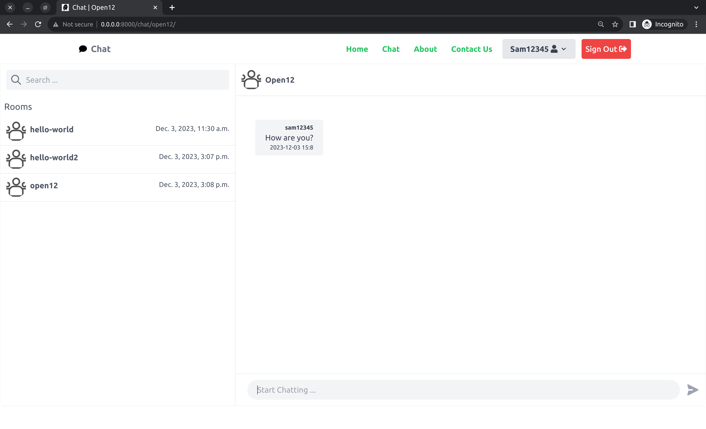

# Chat App

 <p>   
 
  
 
</p>

Real Time Chat App Using Django, Channels, JavaScript, Docker, Tailwind CSS and much more..

- [Features](#features)
- [Screenshots](#screenshots)
- [Tech Stack](#tech-stack)
- [Getting Started](#getting-started)
- [Deploy](#deploy)
- [Bug Reporting](#bug)
- [Feature Request](#feature-request)
- [Change Log](#change-logs)
- [License](#license)

<a id="features"></a>

## 🚀 Features:

-  **Real-time messaging**: The app allows users to send and receive messages in real-time, providing a seamless chatting experience.
-  **Django and Channels**: The app is built using the Django web framework and Channels, which extends Django to handle WebSockets and other asynchronous protocols.
- **JavaScript**: The app uses JavaScript to provide a dynamic and interactive user interface.
-  **Docker**: The app can be containerised using Docker, making it easy to deploy and manage.
-  **Tailwind CSS**: The app uses Tailwind CSS, a utility-first CSS framework, to style the user interface.

Is there anything else you would like to know about this chat app?
- [Request more features](#feature-request)...

<a id="screenshots"></a>

### 📸 Screenshots:
<div align="center">

    <br />

</div>

<a id="tech-stack"></a>

##  📦 Tech Stack:
- [WebSockets](https://developer.mozilla.org/en-US/docs/Web/API/WebSockets_API) - WebSocket is a computer communications protocol, providing full-duplex communication channels over a single TCP connection.
- [Django](https://www.djangoproject.com/) - Django makes it easier to build better web apps more quickly and with less code.
- [Django Channels](https://channels.readthedocs.io/en/stable/) - Channels is a project that takes Django and extends its abilities beyond HTTP - to handle WebSockets, chat protocols, IoT protocols, and more.
- [Vite](https://vitejs.dev/) - Next Generation Frontend Tooling.
- [Tailwind 3](https://tailwindcss.com/) - Rapidly build modern websites without ever leaving your HTML.
- [Docker](https://www.docker.com/) - Docker is a platform designed to help developers build, share, and run modern applications. We handle the tedious setup, so you can focus on the code.
- [Postgres DB](https://www.postgresql.org/) - The World's Most Advanced Open Source Relational Database.


<a id="getting-started"></a>

## 📦 Getting Started:


1. Clone the project and make it your own.
```bash
mkdir ~/Dev
cd ~/Dev
git clone https://github.com/Arvind-4/Chatapp.git
cd Chatapp
```

2. Create virtual environment and activate it.

```bash
python3.9 -m venv .
source bin/activate
```
Use `.\venv\Scripts\activate` if on **Windows.**

3. Install requirements
```bash
$(Chatapp) python -m pip install pip --upgrade
$(Chatapp) python -m pip install -r requirements.txt
```

4. Open VS Code
```bash
code .
```

5. Create `.env` file:

Add Your Credentials `.env` from `.env.sample`:
```
PYTHON_VERSION=

DJANGO_PG_PASSWORD=iz-MAIesYif5c8d53pEnAg
DJANGO_PG_HOST=db
DJANGO_PG_USER=admin
DJANGO_PG_DATABASE=chatdb
DJANGO_PG_PORT=5432

DJANGO_REDIS_HOST=redis
DJANGO_REDIS_PORT=6379

DJANGO_SUPERUSER_EMAIL=
DJANGO_SUPERUSER_USERNAME=admin
DJANGO_SUPERUSER_PASSWORD=-_cYnxeqvWQKhCUe_AJn8Q

DJANGO_SECRET_KEY=P_wXmuyfulz3qZTe3bAmRw5d0-9maJ5PIIVDMjMIm1gw
DJANGO_ADMIN_URL=admin/
DJANGO_DEBUG=1
DJANGO_ALLOWED_HOSTS=*
DJANGO_REDIS_AVAILABLE=0
DJANGO_HTTPS_SECURITY=0
DJANGO_LIVE=0

POSTGRES_PASSWORD=iz-MAIesYif5c8d53pEnAg
POSTGRES_USER=admin
POSTGRES_DB=chatdb
```
Replace your `SECRET_KEY` with a new one using the code Below.

```bash
python -c 'from django.core.management.utils import get_random_secret_key; print(get_random_secret_key())'
```
<p align="center">
	Or
</p>


```bash
bash commands/secret.sh
```

6. Build and Start the Docker File:

Below will start a Docker Instance on your local machine to match the `.env` from the previous step.
```bash
docker compose -f docker-compose.selfhost.yaml build
```
Start the Docker Build Image:
```bash
docker compose -f docker-compose.selfhost.yaml up
```

7. Run Django Commands & Migrations and Create Superuser
```bash
cd ~/Dev/Chatapp
source bin/activate
$(Chatapp) python manage.py makemigrations
$(Chatapp) python manage.py migrate
$(Chatapp) python manage.py createsuperuser
```

Run the server:
```bash
$(Chatapp) python manage.py runserver
```

8. Install & Build the Front end.

Install the Required Dependencies
```bash
npm run bootstrap
```
Build the Front end for Production
```bash
npm run production
```

<a id="deploy"></a>

## 🚀 Deploy:

Click the Button to Deploy to [Render](https://render.com/).

[](https://render.com/deploy?repo=https://github.com/Arvind-4/Chatapp)

<p align="center">
    OR
</p>

Self Host using Docker, Docker Compose in a VM :)

<a id="bug"></a>

## 🐛 Bug Reporting

Feel free to [open an issue](https://github.com/Arvind-4/Chatapp/issues) on GitHub if you find any bug.

<a id="feature-request"></a>

## ⭐ Feature Request

- Feel free to [Open an issue](https://github.com/Arvind-4/Chatapp/issues) on GitHub to request any additional features you might need for your use case.
- Connect with me on [LinkedIn](https://www.linkedin.com/in/a-arvind/). I'd love ❤️️ to hear from you.

<a id="change-logs"></a>

## 📋 Change Log:

Check [here](https://github.com/Arvind-4/Chatapp/commits/main) for change logs.

<a id="license"></a>

## 📜 License

This software is open source, licensed under the [MIT License](https://github.com/Arvind-4/Chatapp/blob/main/LICENSE).
